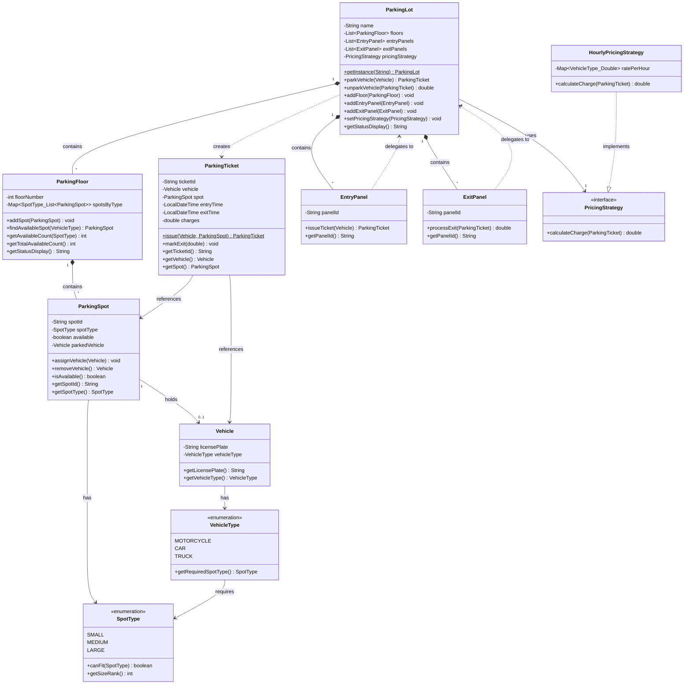
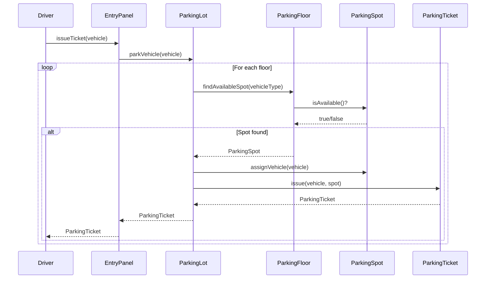
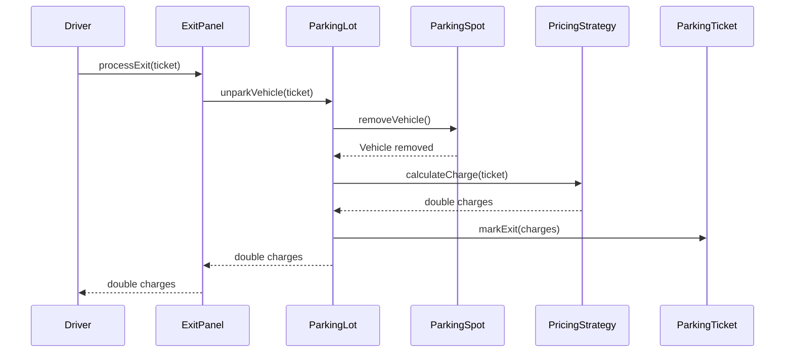
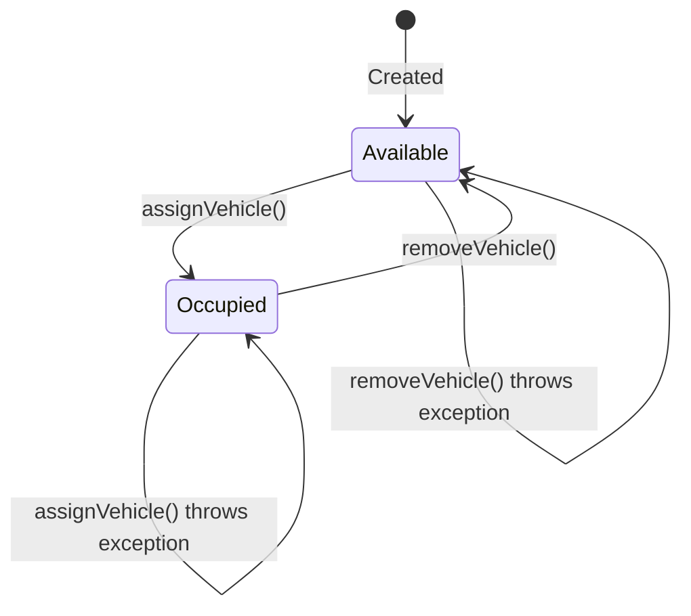

# Class Diagram - Parking Lot System

Detailed class relationships and UML diagrams for the Parking Lot System.

---

## UML Class Diagram



---

## Relationship Types Explained

### 1. Composition (Solid Arrow with Filled Diamond)
**`ParkingLot *-- ParkingFloor`**
- ParkingLot **owns** ParkingFloors
- If ParkingLot is destroyed, floors are destroyed too
- Strong ownership relationship

### 2. Association (Solid Arrow)
**`ParkingSpot --> Vehicle`**
- ParkingSpot **references** Vehicle
- Vehicle can exist independently
- Weak relationship

### 3. Dependency (Dashed Arrow)
**`EntryPanel ..> ParkingLot`**
- EntryPanel **uses** ParkingLot temporarily
- No stored reference (fetches via `getInstance()`)
- Method-level dependency

### 4. Implementation (Dashed Arrow with Hollow Head)
**`HourlyPricingStrategy ..|> PricingStrategy`**
- HourlyPricingStrategy **implements** PricingStrategy interface
- "is-a" relationship

### 5. Creation (Dashed Arrow)
**`ParkingLot ..> ParkingTicket`**
- ParkingLot **creates** ParkingTicket instances
- Factory relationship

---

## Multiplicity Notations

| Notation | Meaning | Example |
|----------|---------|---------|
| `1` | Exactly one | One ParkingLot |
| `*` or `0..*` | Zero or more | Many ParkingFloors |
| `1..*` | One or more | At least one floor |
| `0..1` | Zero or one | Optional Vehicle in spot |

---

## Key Relationships

### 1. ParkingLot → ParkingFloor (1 to Many)
```
One ParkingLot contains many ParkingFloors
- ParkingLot has: List<ParkingFloor> floors
- Relationship: Composition (strong ownership)
```

### 2. ParkingFloor → ParkingSpot (1 to Many)
```
One ParkingFloor contains many ParkingSpots
- ParkingFloor has: Map<SpotType, List<ParkingSpot>>
- Relationship: Composition
```

### 3. ParkingSpot → Vehicle (1 to 0..1)
```
One ParkingSpot can hold zero or one Vehicle
- ParkingSpot has: Vehicle parkedVehicle (nullable)
- Relationship: Association (weak)
```

### 4. ParkingTicket → Vehicle + ParkingSpot
```
ParkingTicket references both Vehicle and ParkingSpot
- Links vehicle to its assigned spot
- Relationship: Association
```

### 5. EntryPanel → ParkingLot (Dependency)
```
EntryPanel depends on ParkingLot
- Calls: ParkingLot.getInstance().parkVehicle()
- No stored reference (temporary dependency)
```

### 6. ParkingLot → PricingStrategy (Dependency)
```
ParkingLot uses PricingStrategy interface
- Calls: pricingStrategy.calculateCharge()
- Can swap implementations
```

---

## Class Responsibilities

### Core Models

**ParkingLot**
- Orchestrates all parking operations
- Manages floors, panels, pricing strategy
- Thread-safe singleton

**ParkingFloor**
- Manages spots grouped by type
- Implements spot search logic
- Tracks availability

**ParkingSpot**
- Manages individual spot state
- Thread-safe assign/remove operations
- Validates availability

**ParkingTicket**
- Records entry/exit information
- Links vehicle to spot
- Factory method for creation

**Vehicle**
- Immutable vehicle representation
- Just data (license plate, type)

### Boundary Classes

**EntryPanel**
- Entry gate interface
- Delegates to ParkingLot
- Issues tickets

**ExitPanel**
- Exit gate interface
- Delegates to ParkingLot
- Processes exits

### Strategy Classes

**PricingStrategy** (Interface)
- Defines pricing contract
- Single method: calculateCharge()

**HourlyPricingStrategy**
- Implements hourly pricing
- Configurable rates per vehicle type

### Enums

**VehicleType**
- Vehicle categories
- Maps to required SpotType

**SpotType**
- Spot size categories
- Size ranking for fallback logic

---

## Sequence Diagram: Parking Flow



---

## Sequence Diagram: Exit Flow



---

## State Diagram: ParkingSpot



---

## Package Structure

```
com.lld.parkinglot
├── enums/
│   ├── SpotType
│   └── VehicleType
├── models/
│   ├── Vehicle
│   ├── ParkingSpot
│   ├── ParkingFloor
│   ├── ParkingTicket
│   └── ParkingLot
├── panels/
│   ├── EntryPanel
│   └── ExitPanel
└── pricing/
    ├── PricingStrategy
    └── HourlyPricingStrategy
```

---

## Design Patterns Visualization

### Singleton Pattern
```
┌─────────────┐
│ ParkingLot  │
│  (Singleton)│
└─────────────┘
      │
      │ getInstance()
      │
      ▼
┌─────────────┐
│   instance  │ (only one)
└─────────────┘
```

### Strategy Pattern
```
┌──────────────────┐
│ PricingStrategy  │ (interface)
└────────┬─────────┘
         │
    ┌────┴────┐
    │         │
    ▼         ▼
┌─────────┐ ┌──────────────┐
│ Hourly  │ │ FlatRate     │ (future)
└─────────┘ └──────────────┘
```

### Factory Method Pattern
```
┌──────────────┐
│ParkingTicket │
│              │
│ issue()      │ (static factory)
└──────────────┘
      │
      │ creates
      ▼
┌──────────────┐
│ParkingTicket │ (instance)
└──────────────┘
```

---

## Summary

This class diagram shows:
- **12 classes** total (2 enums, 5 models, 2 panels, 1 interface, 1 implementation, 1 demo)
- **Clear separation** between models, panels, and pricing
- **Design patterns** applied appropriately
- **Thread-safe** operations where needed
- **Extensible** design for future enhancements

For more details, see [README.md](README.md) and [DESIGN_DECISIONS.md](DESIGN_DECISIONS.md).
