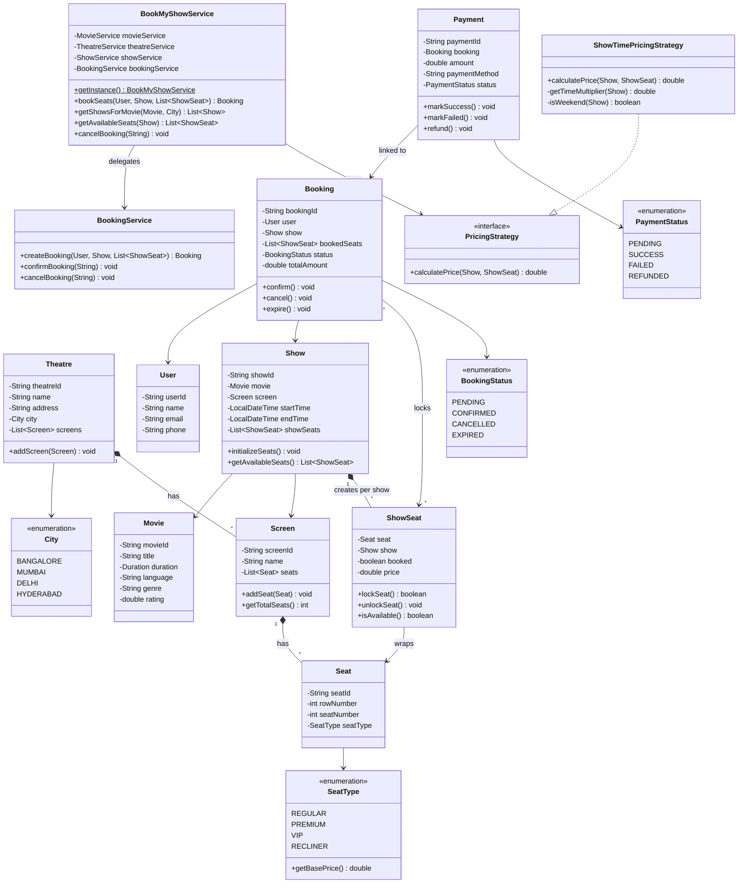

# Class Diagram - BookMyShow

Simplified class diagram showing core structure, relationships, and DB table mappings.

---

## UML Class Diagram



---

## Key Relationships

| Relationship | Type | Description | DB Mapping |
|--------------|------|-------------|-----------|
| `Theatre → Screen` | Composition (1:N) | Theatre owns screens | `screen.theatre_id FK` |
| `Screen → Seat` | Composition (1:N) | Screen owns physical seats | `seat.screen_id FK` |
| `Show → Movie` | Association (N:1) | Show schedules a movie | `show.movie_id FK` |
| `Show → Screen` | Association (N:1) | Show happens on a screen | `show.screen_id FK` |
| `Show → ShowSeat` | Composition (1:N) | Show creates per-show seats | `show_seat.show_id FK` |
| `ShowSeat → Seat` | Association (N:1) | ShowSeat wraps physical seat | `show_seat.seat_id FK` |
| `Booking → User` | Association (N:1) | User makes bookings | `booking.user_id FK` |
| `Booking → Show` | Association (N:1) | Booking is for a show | `booking.show_id FK` |
| `Booking → ShowSeat` | Association (N:N) | Booking locks show seats | `booking_seat` junction |
| `Payment → Booking` | Association (N:1) | Payment for a booking | `payment.booking_id FK` |
| `Theatre → City` | Association (N:1) | Theatre in a city | `theatre.city_id FK` |
| `PricingStrategy → ShowTimePricing` | Implementation | Strategy pattern | N/A (application logic) |

---

## Entity-to-Table Mapping

| Java Class | DB Table | Volume/Year | Key Index |
|------------|----------|-------------|-----------|
| `Movie` | `movie` | ~10K | `FULLTEXT(title)` |
| `Theatre` | `theatre` | ~100K | `(city_id)` |
| `Screen` | `screen` | ~500K | `(theatre_id)` |
| `Seat` | `seat` | ~100M | `(screen_id, row, num)` |
| `Show` | `show` | 73M | `(movie_id, show_date)` |
| `ShowSeat` ⭐ | `show_seat` | 14.6B | `(show_id, is_booked)` |
| `Booking` | `booking` | 180M | `(user_id, booking_status)` |
| `Payment` | `payment` | 220M | `(booking_id)` |
| `User` | `user` | ~100M | `(email) UNIQUE` |

---

## Design Patterns

1. **Singleton** — `BookMyShowService` (single orchestrator)
2. **Strategy** — `PricingStrategy` (swappable pricing logic)
3. **Facade** — `BookMyShowService` (hides service layer complexity)

---

## Package Structure

```
com.lld.bookmyshow
├── enums/       (City, SeatType, BookingStatus, PaymentStatus)
├── models/      (Movie, Theatre, Screen, Seat, Show, ShowSeat, Booking, Payment, User)
├── services/    (BookMyShowService, MovieService, TheatreService, ShowService, BookingService)
├── pricing/     (PricingStrategy, ShowTimePricingStrategy)
└── exceptions/  (SeatNotAvailableException, BookingNotFoundException)
```

---

## Flow Summary

### Browse Flow
```
City → TheatreService.getTheatresByCity()
     → ShowService.getShowsForMovieInCity()
     → Show[] (with theatre/screen info)
```

### Booking Flow
```
Show → Show.getAvailableSeats() → ShowSeat[] (available)
     → BookingService.createBooking()
       → ShowSeat.lockSeat() × N [synchronized]
       → new Booking(PENDING)
     → Payment.markSuccess()
       → Booking.confirm()
```

### Cancellation Flow
```
Booking → BookingService.cancelBooking()
        → Booking.cancel()
          → ShowSeat.unlockSeat() × N
          → status = CANCELLED
```
