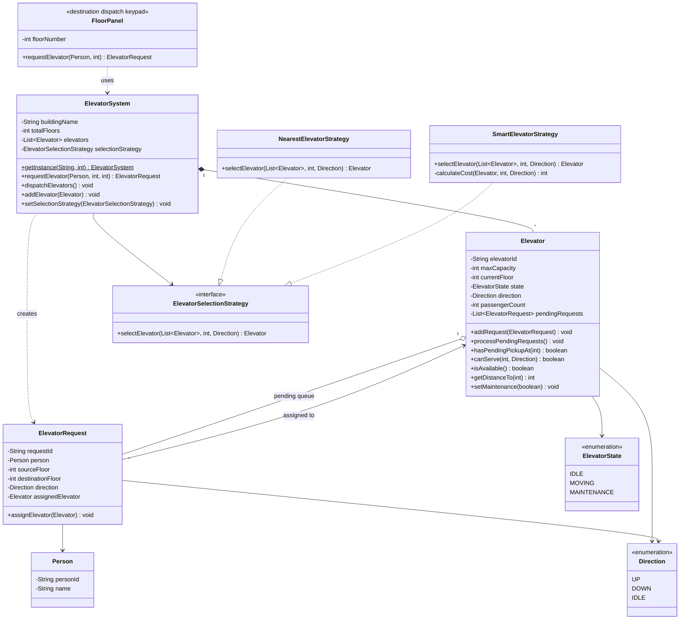

# Class Diagram - Elevator System

Simplified class diagram showing core structure and relationships.

---

## UML Class Diagram



---

## Key Relationships

| Relationship | Type | Description |
|--------------|------|-------------|
| `ElevatorSystem → Elevator` | Composition (1 to Many) | System owns elevators |
| `ElevatorSystem → ElevatorSelectionStrategy` | Dependency | Uses selection algorithm |
| `Elevator → ElevatorRequest` | Aggregation (pending queue) | Elevator holds queued requests |
| `ElevatorRequest → Person` | Association | Request belongs to a person |
| `ElevatorRequest → Elevator` | Association | Request assigned to an elevator |
| `FloorPanel → ElevatorSystem` | Dependency | Keypad delegates to system |
| `SmartElevatorStrategy → ElevatorSelectionStrategy` | Implementation | Implements interface |

---

## Design Patterns

1. **Singleton** - `ElevatorSystem` (one instance per building)
2. **Strategy** - `ElevatorSelectionStrategy` (swappable elevator selection algorithm)

---

## Package Structure

```
com.lld.elevatorsystem
├── enums/        (Direction, ElevatorState)
├── models/       (Person, Elevator, ElevatorRequest, ElevatorSystem)
├── panels/       (FloorPanel — destination dispatch keypad)
└── strategy/     (ElevatorSelectionStrategy, NearestElevatorStrategy, SmartElevatorStrategy)
```

---

## Flow Summary (Two-Phase)

**Phase 1 — Assign:** `FloorPanel` → `ElevatorSystem.requestElevator()` → `SmartElevatorStrategy` → `Elevator.addRequest()` → panel shows "Go to E1"

**Phase 2 — Dispatch:** `ElevatorSystem.dispatchElevators()` → `Elevator.processPendingRequests()` → batch pickup → visit destinations → drop off
