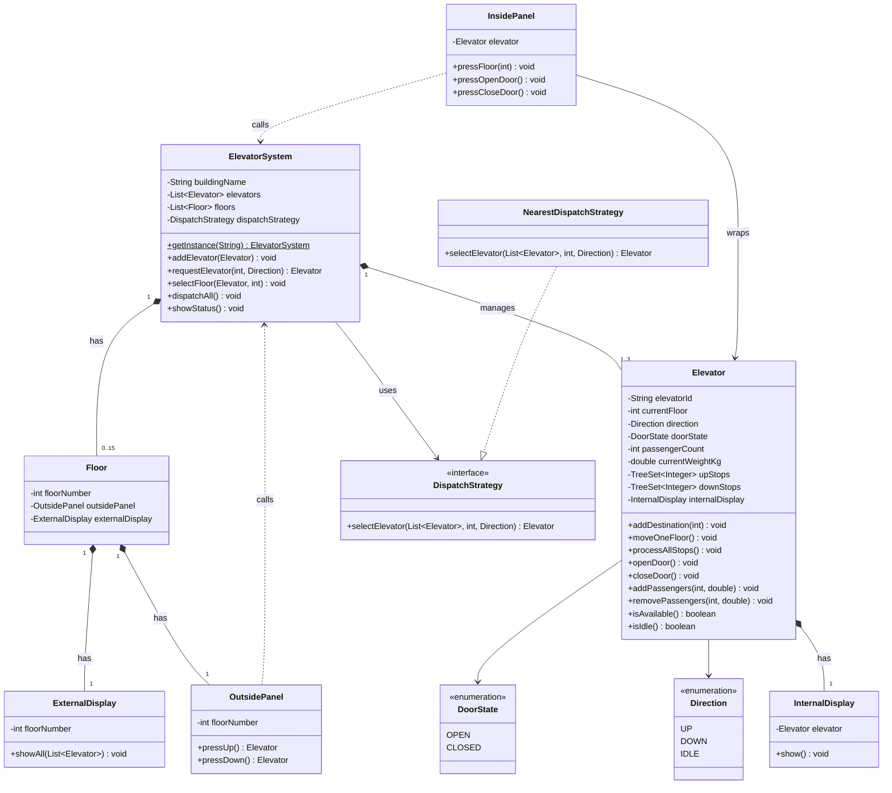

# Class Diagram - Elevator System (Simple)

Simplified class diagram showing core structure and relationships.

---

## UML Class Diagram



---

## Key Relationships

| Relationship | Type | Description |
|--------------|------|-------------|
| `ElevatorSystem → Elevator` | Composition (1 to 3) | System manages up to 3 elevators |
| `ElevatorSystem → Floor` | Composition (1 to 16) | System owns floors 0-15 |
| `ElevatorSystem → DispatchStrategy` | Dependency | Uses strategy for dispatch |
| `Floor → OutsidePanel` | Composition (1 to 1) | Each floor has one outside panel |
| `Floor → ExternalDisplay` | Composition (1 to 1) | Each floor has one external display |
| `Elevator → InternalDisplay` | Composition (1 to 1) | Each elevator has one internal display |
| `InsidePanel → Elevator` | Association | Panel wraps an elevator for control |
| `OutsidePanel → ElevatorSystem` | Dependency | Panel calls system to request elevator |
| `NearestDispatchStrategy → DispatchStrategy` | Implementation | Implements strategy interface |

---

## Design Patterns

1. **Singleton** - `ElevatorSystem` (one controller per building)
2. **Strategy** - `DispatchStrategy` (swappable dispatch algorithm)

---

## Package Structure

```
com.lld.elevatorsystemsimple
├── enums/        (Direction, DoorState)
├── models/       (Elevator, Floor, ElevatorSystem)
├── panels/       (OutsidePanel, InsidePanel)
├── display/      (InternalDisplay, ExternalDisplay)
└── dispatcher/   (DispatchStrategy, NearestDispatchStrategy)
```

---

## Flow Summary

**Call Elevator:**
`OutsidePanel` → `ElevatorSystem` → `DispatchStrategy` → best `Elevator` → `addDestination(floor)`

**Select Floor:**
`InsidePanel` → `ElevatorSystem` → `Elevator.addDestination(floor)`

**Dispatch:**
`ElevatorSystem.dispatchAll()` → each `Elevator.processAllStops()` → `moveOneFloor()` → `stop()` → `InternalDisplay.show()`

---

## Quick-Draw Version (For Whiteboard)

```
ElevatorSystem (Singleton)
  ├── Elevator [1..3]
  │     ├── InternalDisplay
  │     ├── upStops (TreeSet)
  │     └── downStops (TreeSet)
  ├── Floor [0..15]
  │     ├── OutsidePanel → pressUp/Down → ElevatorSystem
  │     └── ExternalDisplay
  └── DispatchStrategy (interface)
        └── NearestDispatchStrategy

InsidePanel → wraps Elevator → pressFloor/OpenDoor/CloseDoor
```
