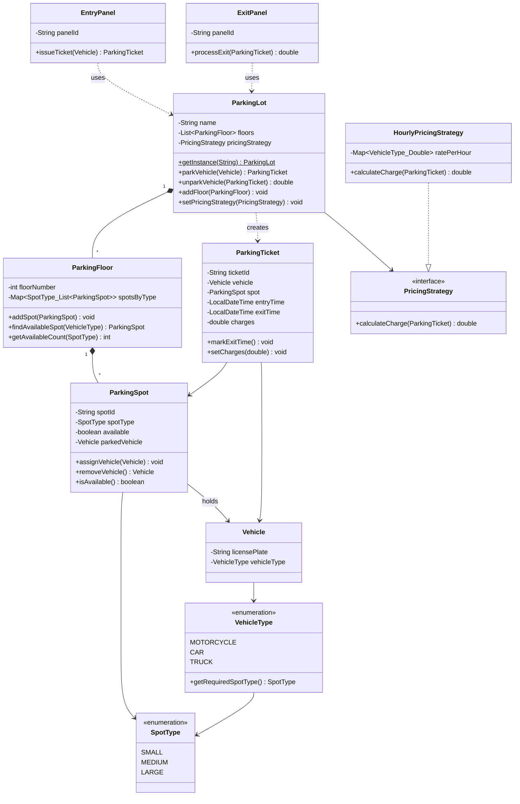

# Class Diagram - Parking Lot System

Simplified class diagram showing core structure and relationships.

---

## UML Class Diagram



---

## Key Relationships

| Relationship | Type | Description |
|--------------|------|-------------|
| `ParkingLot → ParkingFloor` | Composition (1 to Many) | ParkingLot owns floors |
| `ParkingFloor → ParkingSpot` | Composition (1 to Many) | Floor owns spots |
| `ParkingSpot → Vehicle` | Association (1 to 0..1) | Spot can hold one vehicle |
| `ParkingTicket → Vehicle + Spot` | Association | Ticket links vehicle to spot |
| `EntryPanel → ParkingLot` | Dependency | Panel uses ParkingLot |
| `ExitPanel → ParkingLot` | Dependency | Panel uses ParkingLot |
| `ParkingLot → PricingStrategy` | Dependency | Uses pricing interface |
| `HourlyPricingStrategy → PricingStrategy` | Implementation | Implements interface |

---

## Design Patterns

1. **Singleton** - `ParkingLot` (one instance)
2. **Strategy** - `PricingStrategy` (swappable pricing)

---

## Package Structure

```
com.lld.parkinglot
├── enums/        (SpotType, VehicleType)
├── models/       (Vehicle, ParkingSpot, ParkingFloor, ParkingTicket, ParkingLot)
├── panels/       (EntryPanel, ExitPanel)
└── pricing/      (PricingStrategy, HourlyPricingStrategy)
```

---

## Flow Summary

**Entry:** `EntryPanel` → `ParkingLot` → `ParkingFloor` → `ParkingSpot` → `ParkingTicket`

**Exit:** `ExitPanel` → `ParkingLot` → `ParkingSpot` (free) → `PricingStrategy` (calculate) → return charges
